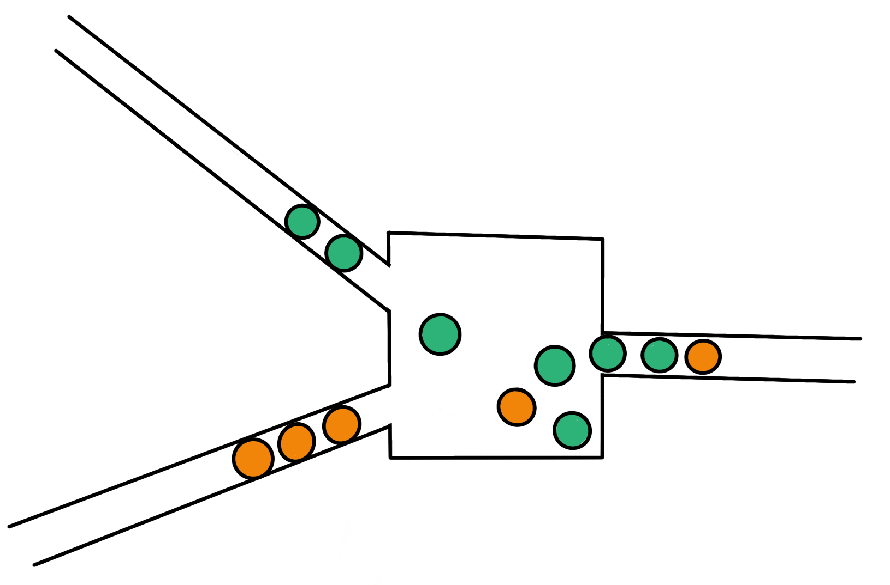

# Your ping will not improve!

March 2022

Unless a serious revolution in physics happens or games put more attention on the importance of server geo-location.

## Introduction

Over life (I was born 1992 in Poland) I could observe astonishing progress in IT and especially network technology around me. Things which were unimaginable 20 years ago now are reality. It is hard to believe: at that time, access to the internet was a wet dream in my country. Now everyone has a phone with 5G, LTE or at least HSPA in the pocket, while at home most have optic fiber or at least ADSL. What could be expected in the past was 115 kbps, however in most cases available bandwidth was lower than 50 kbps. Few years later you could get 512 kbps for a good bag of gold in Poland, but 128 kbps was the more viable option. To better imagine the situation, my whole country (38 million people)  had just one 40 Mbps link to the USA -- madness. I likely would use half of that today by watching a movie on Netflix (ok – only if the movie would be downloaded directly from America, which is not the case). 

Nowadays I live in a different reality – I have 100 Mbps internet for less than the cost of one dinner at a restaurant – and it is cheaper than the monthly fee for said Netflix. Bandwidth of my current connection is 80000% better compared to my dreams 20 years ago. With latency, the situation is similar– now I have stable ping to all cities in Poland fairly below 20 ms, for almost all Europe around 35 ms, USA and Australia “sucks” at 100 to 200 ms, while not that long ago, I literally could use a stopwatch to measure my pings!

I used to live with the perception that all things in IT constantly improve at an exponential rate. Of course this is kind of irrational and wishful thinking, but still. First time the illusion started to fall was when I observed that computers are slowly reaching the point where [Moore's law](https://en.wikipedia.org/wiki/Moore%27s_law) [1] stopped to hold. At that time, however, multiprocessor and multicore conceptions became popular and everything “went back to normal” – the new limit at least for some time will be [Amdahl's law](https://en.wikipedia.org/wiki/Amdahl%27s_law) [2]. There are other technological marvels as well – soon  analog computers may re-appear in AI and bulk data processing, optical processors, spin processors, there are Google engineers who work on quantum computers, etc. These developments might be counted as “cheating”, but at least subjective processing power increase will not stop for some time!  Simply there are areas for progress, and this is a very reassuring thought -– at least for me.

Unfortunately, I got sad when many years ago I realized that there are other very important limits which we will likely reach soon and there is literally nothing, that could be done about it. One of these limits is network propagation delay.

In some simplification of subject, only three basic properties of your Internet connection have an impact on your online gaming experience - bandwidth, delay and jitter. In this blog post, I will try to explain what these terms mean, why I think latency will not improve for you in a major way for distant locations and most importantly: what could be done to improve the situation.

### Bandwidth
This property is rather simple. It defines how much data you can receive or send to another computer in a given unit of time. What is worth to mention is the fact that you may have symmetric or asymmetric network bandwidth access. As a consumer you may often need higher downlink than uplink bandwidth.

* Uplink – how much data you can send to others in given unit of time.
* Downlink – how much data you can receive from others in given unit of time.
* Symmetric bandwidth – uplink value is equal to downlink.
* Asymmetric bandwidth – uplink value is not equal to downlink.

For example, when you install a game from Steam, you want high downlink because you want to download it fast, while uplink is less important because your PC only needs to rarely ask the Steam server for the next piece of game data or check if the data received so far is correct. As you may imagine, it is the opposite situation from a Steam server perspective. It is almost unidirectional data traffic in terms of volume. Because most of us are data consumers, optimizing the network for asymmetric transmissions makes lot of sense from a network provider’s perspective and allows to reduce costs.

For other purposes than browsing web pages and watching movies, including online games, both uplink and downlink bandwidth must be high for best results.

Bandwidth is measured in Gbps (Gigabits per second), Mbps (Megabits per second), or Kbps (Kilobits per second). Internet providers often, when stating bandwidth  in marketing materials, refer to maximal downlink bandwidth, so it’s worth to check if uplink is reasonably high as well and what is guaranteed value of both (if any!). 

Sometimes you may face as well the terms “throughput” and “goodput”, which are correlated terms. While bandwidth is the theoretical capacity of a network to transmit a given amount of data over time, throughput is the actual amount of data you can transmit at a given moment to a given destination in practice. So throughput is never bigger than bandwidth – often substantially smaller. Goodput is throughput subtracted by all used protocol overheads, so it gives the about amount of transferred data over time, which is “useful” for your application.

You may sleep well – according to my knowledge, nothing is indicating that consumer bandwidth increases will slow down anytime soon. In the worst case, we can always just use more or thicker cables.

### Network Delay
This property defines how long it take for a message to arrive at the destination from the time it was send from the source. Network delay consists of 4 major components:
* Transmission delay – how long does it takes to put the signal on the transmission medium?
* Propagation delay – the time it takes for the signal to go from one device to another. It is equal to the distance between the devices divided by the signal propagation speed.
* Queuing time – it is the sum of all periods the signal is stored on intermediate devices before it can continue moving. Typically, this is correlated with network congestion, I.e. queuing time increases when the network is congested.
* Processing delay – how long does it  take to process the signal?
 

Figure 1: Unlucky coincidence -- packets are coming from two links at the same time and must be queued before they can continue moving.

There is another similar term: latency. Difference between these two is subtle – delay refers to the time when just the first piece of data arrives at the destination, while latency refers to receiving the whole data which was sent.

Network delay can be measured as round-trip-time (RTT) or one-way-delay (OWD). RTT is the time it takes to send data from computer A to computer B and receive on A the response from B, while OWD is only about the time between A and B. That means RTT = sum of OWD in one direction and OWD in opposite direction. In practice, measuring RTT is simpler, as to do so, you do not need synchronized clocks on both machines. The popular tool “ping” is measuring RTT using [ICMP](https://en.wikipedia.org/wiki/Internet_Control_Message_Protocol) echo packets. 

 

Figure 2: Your PC most likely does not have built-in table tennis racket, but I couldn't resist to put it in ping illustration.

Because of all delay-causing factors, OWD for each packet might be different – especially if we consider that data between two machines in complex networks might be routed differently, so may travel via totally different intermediate devices and transmission mediums between them.
 

Figure 3: Each packet transmission may be routed differently and for each network condition might be different. Routing packets from Paris to Wrocław via Rome is not the best idea and I hope it happens only on this picture!

Online game players often use the “lag” term, which is loosely related to network latency. Lag basically mean that a game is noticeably and subjectively not responsive – there might be a lot of reasons for it beside problems with the network – for example overloaded game servers, anti-virus or firewall activity, not sufficient processing power or even the PC overheating. 

### Jitter
Jitter refers to the variance of transmission properties or measurements over time. It may be used to describe any observed network property fluctuations, but in most cases it is about network delay or latency. Because jitter might be very hard or impossible to predict, it is very hard to implement a good strategy to deal with it in games and minimize devastating effects on your gaming experience. While for example the effect of network delay  on your subjective experience might be minimized by using proper delay extrapolation or interpolation techniques in the game, combined with rewinding and compensation on the server, high jitter can’t be compensated. In addition, you are capable to learn how to play with a certain constant lag but you can’t adapt your game play to high jitter.

## Why I think my ping will not improve greatly?
As you already know, network delay is the sum of transmission delays, propagation delays, queuing delays and processing delays. If we would get rid of all delays except propagation delay, we would have the smallest possible network delay (only limited by the speed of light). For example, I live in Wroclaw in Poland, so the distance in crow flight to New York in USA is around 6680 km. Speed of light in vacuum is around 299800 km/s. If there would be a direct connection between those two points placed on the surface of earth and the signal would move through the wire with the speed of light in vacuum, the ping tool (which measures RTT) could show 45 ms. My ping to nyc.mirrors.clouvider.net  is 108 ms and according to the IP geo-location database I use, this Debian FTP mirror is indeed located near New York. This mean that the possible minimal ping is only slightly more than 2 times shorter than the ping I measure right now. 

In practice, however, it is hard to imagine that I could have straight connection to every place in the world. So the distance over which my signal is traveling must be significantly longer than 6680 km. This is like with roads topology – if there would be a direct connection from every city to all other cities, then there would exist barely nothing else but roads. If we abuse this analogy a bit further, then it is possible to find some “distance increase” factor for crow flights vs. actual land transport distance. I tried it for a few capitals in Europe and it seems to be around 28% longer to go via road than what the direct distance is in most cases – this gives some brief orientation how big this “additional distance” may be.

For more, the speed of light is that high only in vacuum – in other materials, light is slower and to maintain good signal condition, optic fibers use total internal reflection effect which as well increase distance, because light does not travel straight through the fiber but instead “bounces” between the sides of the fiber. Rule of thumb is that signal speed in optical fibers is currently around 2/3 of the speed of light in vacuum. This factor is subject to further technological improvements – similarly to other components which affect delay.

Figure 4: The propagation of light through optical fiber.
 
We could in theory reduce this distance – for example instead of putting wires on earth surface between 2 points, we could somehow drill straight tunnels between these to avoid globe curvature, keep perfect vacuum in these tunnels and send signals using “Microwave Star Trek Phasers” from one point to another via such tunnels. Even if this idea is ridiculous – especially the digging aspect (the deepest human-created hole on earth so far is a mere 12 km super-deep borehole), it will not reduce that much distance and in result your ping!

Figure 5: Star Trek phasers could help, but not too much... By digging a hole between New York and Wroclaw, we could reduce distance from 6680 km to 6370 km (5%). For Auckland in New Zealand (which is roughly on the opposite side of the globe), such project would reduce the distance from 17650 km to 12500 km (29%).

This means, regardless of the enormous cost of such a project, heroic efforts of the engineers and scientists to make it possible, my ping will not be shorter than 84 ms to Auckland and 43 ms to New York!

Here you can take a look at a table which shows my actual ping to various places around the globe, flight distance, theoretical minimal ping without making terrible holes in earth and ratio between theoretically possible ping vs. my actual pings.

Figure 6: City names for given Debian Linux mirrors were found by “consensus” with help of few public IP geo-location databases. I roughly measured crow flight distance between Wroclaw and each city using Google maps.

As you can see, for many places around the globe my pings are just two to three times longer than the lowest theoretically possible. Even in case of places for which “ping ratio” is worse I simply can’t expect that it will improve 10 times, for some I may expect at most a 50% improvement.
Because I will likely never have ping times better than 106 ms to Australia, playing FPS games with someone there will always be at least slightly laggy - 53 ms would be minimal RTT if the server would be located in middle between us (near Bangkok?).

Attentive reader will spot that I generally have better results in “ping ratio” for very distant locations – that is because for most of the distance to these destinations, my packets use “high-speed network highways” instead of “neighborhood and local roads” with many “crossings”, “roundabouts” and "traffic lights”.

So you imagine now, that distance is a serious problem for network delay. Things may become even worse if you would ever try to play with a hypothetical friend who lives on the Moon or on Mars -– for Mars you will have pings between 9 and 45 minutes, while for Moon they are around 2.5 s. I know that Counter Strike will not be playable this way 😉. You can try to recreate a similar experiment with your favorite game using [clumsy]https://jagt.github.io/clumsy/) (a tool to simulate adverse network conditions) on your own –- have a great time as a lunar rover operator!

## Summary - What can be done about it?

### Game network topology, server location and match-making decisions matter

Key thing, which every online game should do to provide a good experience is knowing its own players. Based on the player base -– their physical location and Internet services they use to play the game, the server locations should be chosen – better  more than just a few. Otherwise some of players will be in a very privileged position versus those who have higher latencies. The decision shouldn’t be made purely based on geographical data, but instead on actual measurements of latency and jitter, so based on the available network topography. Games should be tested for different network conditions as well to avoid the effect that “it works great on the developer PC”.

With the rise of streaming services’ popularity like Google Stadia or GeForce Now, streaming server locations should be taken into account as well. It may be beneficial in the future to have your game servers close to streaming service provider – this way, latency to streaming service and actual game server will not build up.

Deciding on a particular server’s location is especially vital for smaller games where both affording a big number of server locations is not economic, and finding participants to match in a given region is hard, because of low “player population”. In such cases finding the right “middle point” may help to the provide a reasonably smooth experience for everyone, and at the same time allows to find match participants easier.

In some cases it might be worth to consider using private network relays and infrastructure designed with gaming in mind – especially to efficiently connect players from distant localizations.

For online games, in my opinion, client-hosted servers or P2P approaches (even for deterministic lockstep games) should be avoided like the plague, because these not only add to latency and make it harder to implement scalable synchronization between players, but in addition they make cheating way easier. In such models, there is no trusted, authoritative participant in the communication or all game instances have full information about other players’ actions – both can be easily abused.

Instead, a client-server approach should be preferred whenever possible, because the server may cut down the distance between players, give some control over player latencies and what is most important, it should be used as primary layer of protection against cheating. 

Figure 7: Client-server may help with latency and prevent cheating

### After 50 years we deserve something more than TCP and UDP

Especially for fast-paced game genres like first person shooters or fighting games, low latency is crucial, while packet loss and delivery order is not that important. Choosing UDP over TCP may make a big difference as it allow for better control in case of frequent, small, and self-contained data updates.

TCP was designed in a way to guarantee reliable, ordered and fault-resistant delivery of data. These properties are achieved with non-negligible costs for some use-cases. If, for example, a packet is lost or corrupted on the way, the TCP protocol will automatically ensure retransmission. Because in TCP data is send as streams, such retransmissions may block entirely the delivery of other already received data until retransmission is complete. Besides that, TCP implementations tend to perform optimizations for certain traffic characteristics. For example, [Nagle’s algorithm](https://en.wikipedia.org/wiki/Nagle%27s_algorithm) ensures that small requests will be grouped together until they form a bigger chunk of data or some timeout elapses, before data would be put on the wire – this timeout might be huge – the default value can be even 200 ms. In general, TCP is a complex state machine with lots of parameters, timers and quirks designed half century ago, where needs and capabilities of networks were different. It doesn’t change, however, the fact that for most applications it provide a good balance between functionality, performance and complexity to use.
In UDP, on other side, there is no guarantee about data delivery order or even if it will be delivered at all, so if one of these properties are required, then must be ensured by the application. UDP was designed in 1980, so some assumptions may not fit well to current network realities.

None of the above mentioned protocols can for example be guided by the application with regards to packet routing, data redundancy and delivery priorities, or link congestion control, while such abilities could greatly improve latency and jitter for many practical purposes.

Such limitations were noticed many years ago and resulted in the [SCTP](https://en.wikipedia.org/wiki/Stream_Control_Transmission_Protocol) protocol definition in October 2000. While SCTP offers nice properties, it settled well mainly in enterprise and  telecommunication and has little support outside the BSD and Linux in desktop world. For example there is up until now no official implementation in Windows (shame!), due to “lack of interest” from existing desktop applications. This is a classic example of a chicken-and-egg problem. There can’t be big use of technology if there is nothing which offers such technology. In my opinion big corporations wasted chance to have a really good alternative for the aging TCP and UDP.

As you see, both gaming transport protocols used in practice are super old and maybe it’s time for a well-deserved retirement!

Fortunately, recently such interest in new transport protocols is more visible and obvious in areas outside telecommunication or VoIP. For example the QUIC protocol designed on top of  UDP is gaining popularity. Pressure to use the IETF [QUIC](https://en.wikipedia.org/wiki/QUIC) variant as transport protocol for [HTTP/3](https://en.wikipedia.org/wiki/HTTP/3) is big. While QUIC is good at fixing issues for HTTP traffic related to TCP drawbacks, it does not solve many other essential problems, and thus does not offer much besides standardization of things that games have solved by augmenting UDP in their own way. Features like multihoming, multipathing, new congestion control methods are missing. However, just the fact QUIC exists and latency problems were one of major concerns give hope for more fundamental changes in popularization and invention of new transport layer protocols, which better address current needs. As a side effect of the work on QUIC and likely its dominant role for the World Wide Web in the near future, I would expect that UDP becomes dominant in the overall traffic mix and at least network hardware support for UDP will be better.

Other promising protocols seems to be more actively discussed recently -– for example [DCCP](https://en.wikipedia.org/wiki/Datagram_Congestion_Control_Protocol), especially the MP-DCCP extension might be new, better UDP alternative for games which are heavily delay or delay jitter dependent, thanks to packet redundancy with multipathing on wireless media.

In my opinion, however, the next big thing in Internet evolution and latency jitter reduction will be a serious attempt to replace or assist ARQ with erasure codes – especially due to growing research interest on linear network coding – but this subject alone well deserve a separate blog post! 

## Bonus

I created script which you can download, run and share your results. It measures your average ping for selected servers around the world and tries to the find your city name based on IP address. It will not send any data to us – instead it just will print a report on your console, so you can copy-paste it at will. If you use VPN or other form of tunneling, please add information about such fact – it can greatly bias results.

You can find full source code at [https://github.com/DenuvoSoftwareSolutions/ping-them-all](https://github.com/DenuvoSoftwareSolutions/ping-them-all).
With results from all of you, I will create a public database of delays between geographical locations, which may help games in implementing better match-making and deciding about server locations.

[1] Moore's law is the observation that the number of transistors in a dense integrated circuits doubles about every two years.

[2] Amdahl's law is model describing dependency between expected speedup of parallel versus sequential algorithm execution under assumption that scope of task will stay same in both cases - stating that the speedup of a parallel program is limited by its sequential portion.

